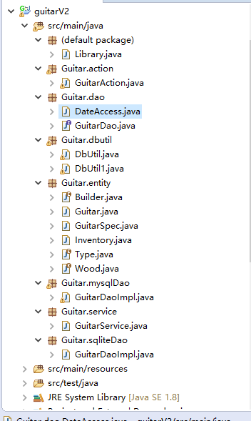
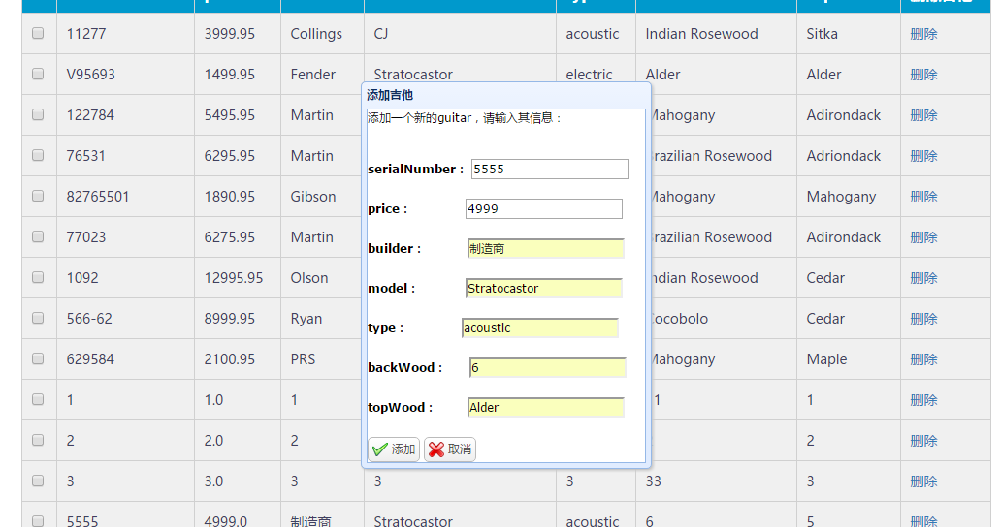
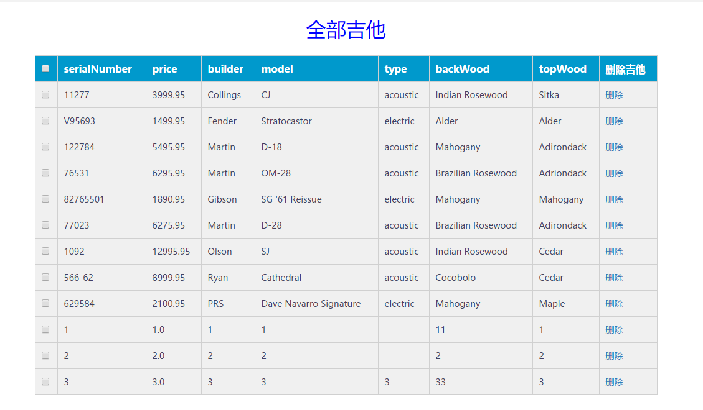
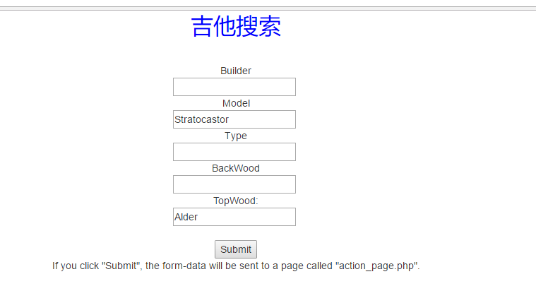
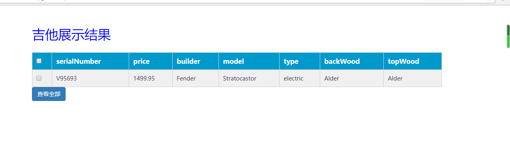
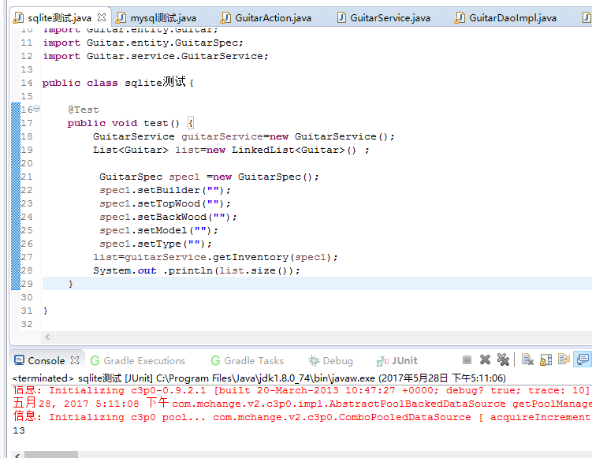
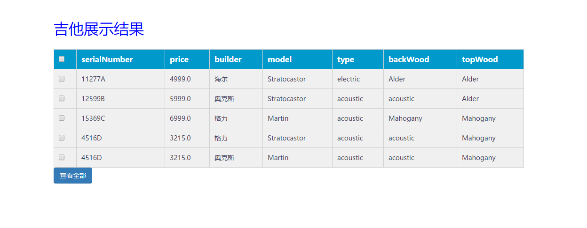
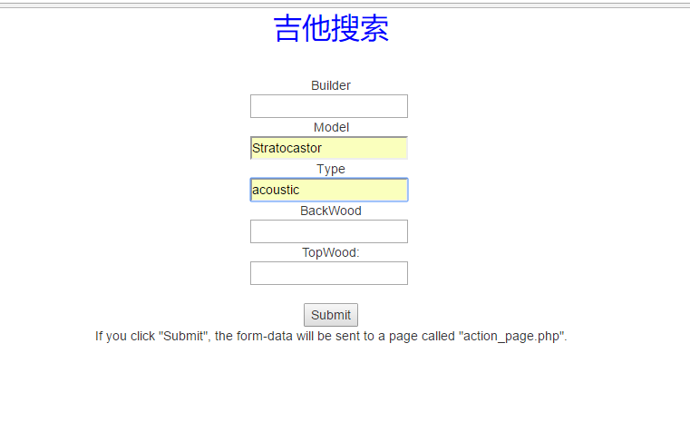
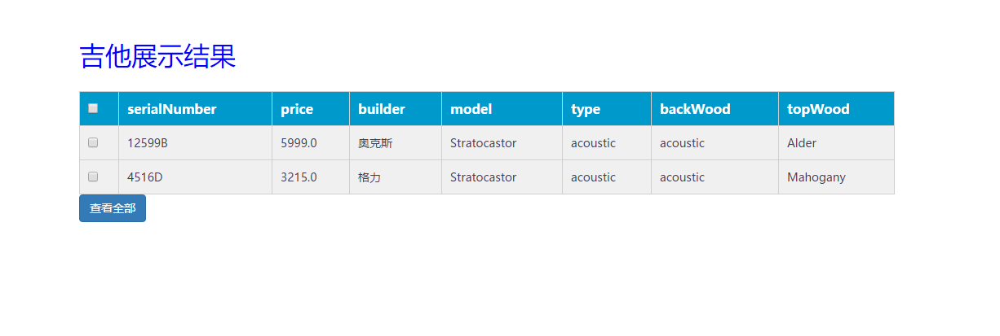
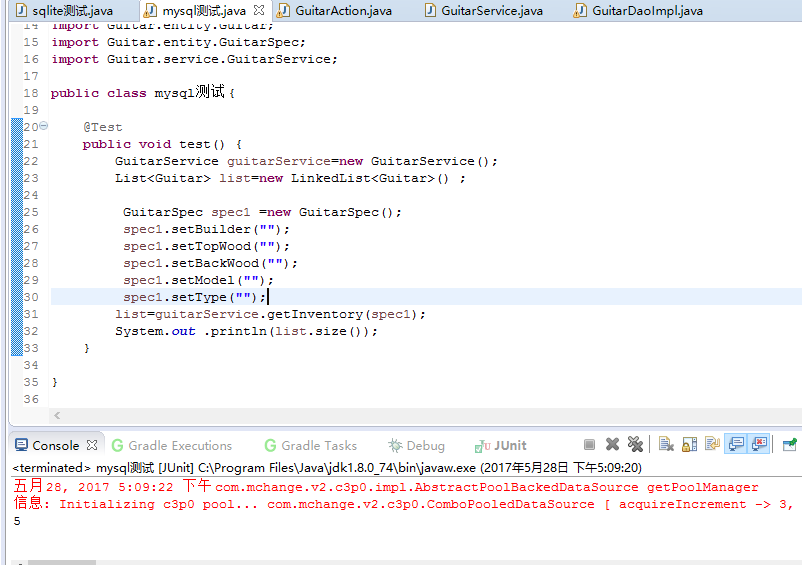

# GuitardviAssess
## 老师，我用了mysql和sqlite两个数据库。如果想增加数据库和类就必须增加dbutil，这是不用配置文件的弊端。也要更繁琐一点，但实现了只改一个地方就换数据库。
## 接下类是数据的截图和测试
## 分层

## 添加吉他

## sqlite全部吉他

## sqlite搜索

## sqlite搜索结果

## sqlite测试

## mysql全部吉他

## mysql搜索

## nysql搜索结果

## mysql测试

